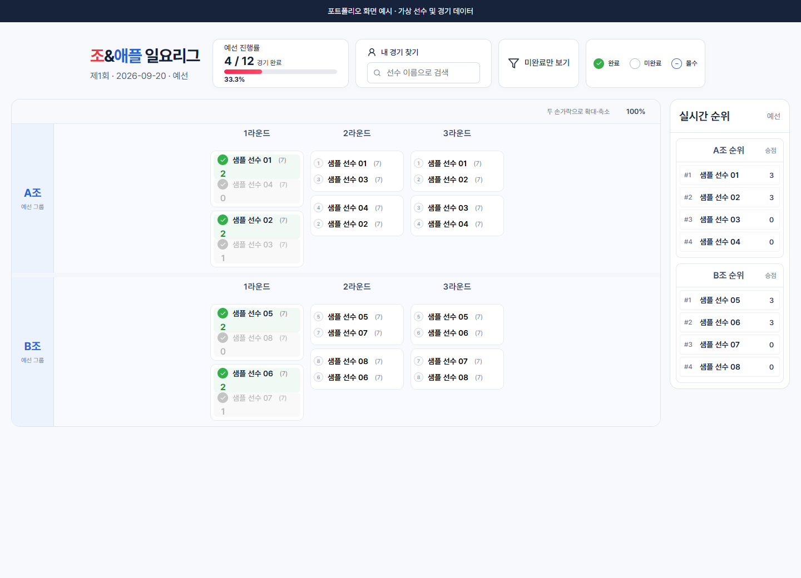
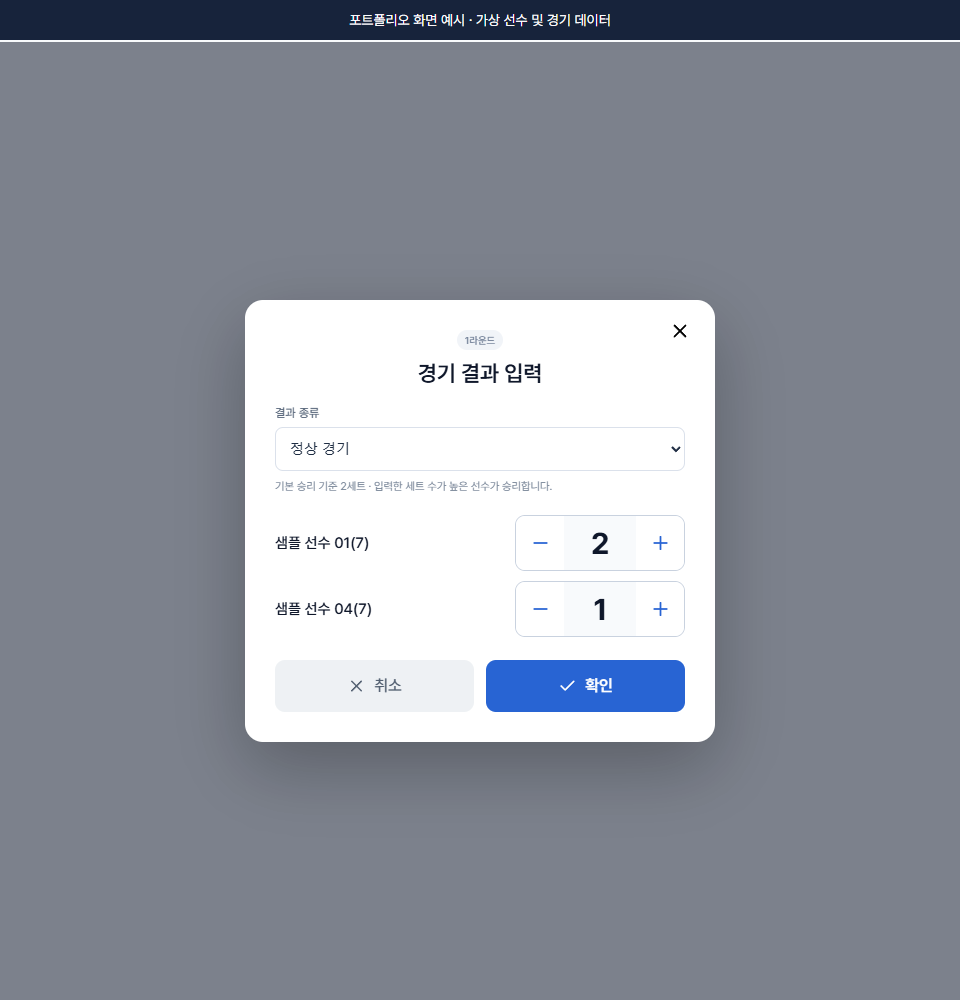
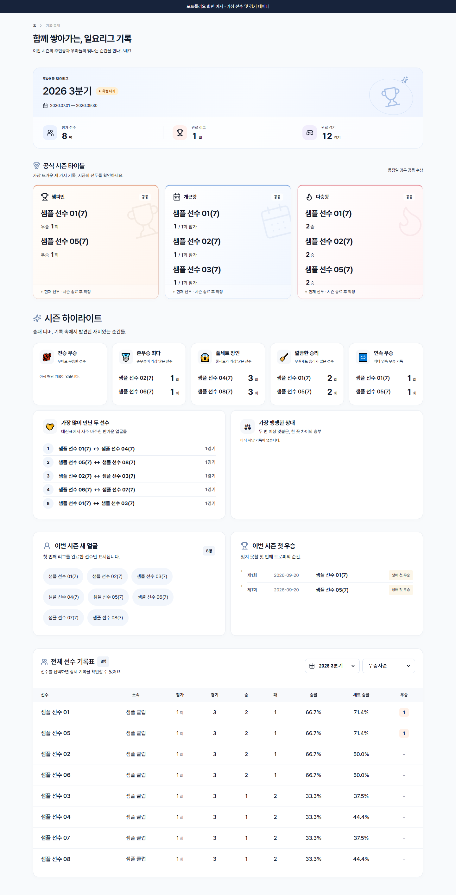
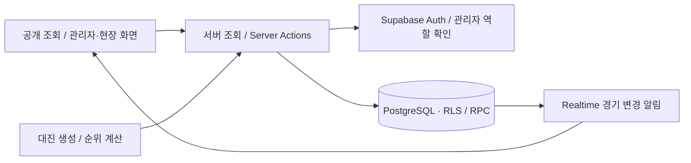

# 일요 탁구 리그 · Sunday Pingpong League

**실제 운영한 일요 탁구 리그를 위한 개인 프로젝트입니다.** 선수 등록부터 대진 생성, 현장 경기 결과 입력, 시즌 통계까지 하나의 웹 서비스에서 관리합니다.

Next.js · TypeScript · Supabase를 사용했으며, Cloudflare Workers 배포를 위한 vinext 구성도 포함합니다. **공개본은 개인정보 보호를 위해 운영 회원·경기 데이터와 기존 Git 이력을 제외하고 가상 데이터를 사용합니다.**

## 만든 이유

탁구 리그 운영에서는 참가자 구성, 조 편성, 경기 진행 상태 확인, 결과 입력, 회차별 순위와 시즌 기록 관리가 이어집니다. 이 작업을 같은 데이터 흐름으로 연결하고, 운영자는 현장에서 결과를 입력하며 참가자는 공개 화면에서 대진과 기록을 확인할 수 있도록 만들었습니다.

## 주요 화면

아래 화면은 **실제 앱 컴포넌트를 가상 선수·경기 데이터로 렌더링한 예시**입니다. 운영 데이터나 실제 회원 정보는 포함하지 않습니다.

### 대진표와 현장 운영

조별 대진, 경기 진행률, 선수 검색, 실시간 순위를 한 화면에서 확인합니다. 관리자·운영자는 경기 카드를 선택해 결과를 입력하고, 공개 화면에서는 읽기 전용으로 조회합니다.



<details>
<summary>경기 결과 입력 화면 보기</summary>

정상 경기와 몰수 경기를 구분하고 세트 점수를 입력합니다. 종료된 시즌의 결과를 수정할 때는 별도 확인을 요구합니다.



</details>

<details>
<summary>시즌 통계 화면 보기</summary>

시즌별 우승·참가·승리 기록, 주요 하이라이트와 선수별 승률·세트 승률을 확인합니다.



</details>

## 주요 기능

| 영역 | 구현 내용 |
| --- | --- |
| 선수·참가자 관리 | 선수 정보 등록·수정, 참가자 선택, 경기 순서와 조 편성 |
| 대진 생성 | 풀리그·단일 탈락 토너먼트, BO3·BO5 규칙, 예선·본선 구성 |
| 현장 운영 | 경기 찾기, 결과 입력·정정, 몰수 처리, 진행률·순위 조회 |
| 기록·통계 | 회차별 기록, 선수별 이력, 시즌 통계와 공식 시즌 결과 확정 |
| 공개 조회·권한 | 공개 기록 화면과 관리자 화면 분리, Auth·RLS·RPC 권한 검사 |
| 모바일 사용 | 모바일 경기 목록, 대진표 확대·축소, 반응형 기록 화면 |

## 담당 역할과 개발 도구

개인 프로젝트로 전체 기획·구현을 담당했습니다. 선수·리그·경기·시즌 데이터 모델, 대진·순위 계산 로직, 관리자 및 공개 화면, Supabase 연동과 배포 구성이 구현 범위입니다.

AI 코딩 도구를 개발 보조로 활용했으며, 공개 전 보안 점검·보완과 포트폴리오 문서 정리에도 사용했습니다. 아래 설명은 저장소의 코드와 수행한 검증을 기준으로 작성했습니다. 사용자 수·운영 기간·시간 절감률 등 확인되지 않은 성과 수치는 제시하지 않습니다.

## 기술 구성

| 기술 | 사용 목적 |
| --- | --- |
| Next.js App Router · React · TypeScript | 페이지 구성, 서버 조회·변경 작업, 화면과 도메인 타입 |
| Supabase Auth · PostgreSQL · RLS · Realtime | 인증, 관계형 데이터 저장, 권한 제어, 경기 변경 알림 |
| Zod | 폼 입력과 서버 작업의 입력 검증 |
| Vitest | 대진 생성·순위 계산·상태 전이·권한 검사·화면 렌더링 테스트 |
| vinext · Vite · Cloudflare Workers | Workers용 빌드·배포 구성 |



## 기술적 판단

### 참가 당시 정보 보존

현재 선수 정보와 회차별 참가 기록을 분리하고, 참가 당시 이름·부수를 스냅샷으로 저장합니다. 이후 선수 정보를 수정해도 과거 리그의 참가 기록을 함께 덮어쓰지 않습니다.

관련 코드: [참가자 스냅샷 매핑](src/lib/league-mappers.ts), [테이블·RLS 정의](supabase/migrations/202608270001_initial_schema.sql)

### 결과에서 통계 계산, 공식 결과는 확정

누적 승패를 선수 정보에 직접 저장하는 대신 경기 결과에서 계산합니다. 시즌 공식 수상 결과는 별도 확정하고, 종료된 시즌의 경기 결과를 수정할 때는 변경 확인과 재검수 흐름을 둡니다.

관련 코드: [순위 계산](src/domain/standings/calculateStandings.ts), [시즌 통계](src/lib/statistics.ts), [시즌·결과 정정 RPC](supabase/migrations/202609090001_seasons.sql)

### 서버와 DB에서 권한 확인

관리자 화면 진입뿐 아니라 데이터 변경 Server Action과 DB의 RLS·RPC에서도 권한을 확인합니다. 공개 결과에서 작성자의 인증 계정 UUID를 제외하고, Realtime 역시 해당 식별자가 포함된 결과 행을 직접 게시하지 않도록 보완했습니다.

관련 코드: [Server Actions](src/app/actions.ts), [화면 진입 검사](middleware.ts), [결과 작성자 보호 마이그레이션](supabase/migrations/202610010001_protect_result_author.sql)

## 검증과 현재 한계

2026-10-01 공개본 준비 시 확인한 결과입니다.

- **테스트 71개 통과:** 대진·순위 계산, 리그 완료·삭제·재생성 조건, 통계·화면 렌더링, 관리자 진입 차단과 공개 보드 읽기 전용 동작 등.
- **ESLint·TypeScript 검사, Next.js 빌드 통과.** vinext/Cloudflare 빌드도 확인했습니다.
- **의존성 취약점 조회 0건:** 점검 당시 `pnpm audit` 기준이며 향후 새 권고는 재확인해야 합니다.
- **공개본 검사:** 운영 명부·연결 임시파일·로컬 환경값과 원본 이력을 제외했습니다.

운영 DB에 새 보안 마이그레이션을 적용하거나 실제 서비스에서 변경 동작을 재검증한 결과는 포함하지 않습니다. SQL 권한 검사는 [public_security.sql](supabase/tests/public_security.sql)에 남겼으며, 별도 개발 DB에서 실행해야 합니다. 설정·적용 안내는 [SECURITY.md](SECURITY.md)에 있습니다.

현재 구현에는 통계 원본을 나누어 조회하는 방식과 일부 여러 단계 저장이 남아 있습니다. 데이터량이 늘면 조회 범위를 좁히고, 최초 대진 생성·리그 종료의 저장 과정을 트랜잭션으로 묶는 개선을 고려할 수 있습니다. PWA 설정은 포함하지만 오프라인 결과 입력·동기화는 제공하지 않습니다.

---

## 개발 환경

Node.js 24, pnpm 11.19.0을 사용합니다.

```powershell
pnpm install --frozen-lockfile
Copy-Item .env.example .env.local
```

`.env.local`에 별도 개발 프로젝트의 `NEXT_PUBLIC_SUPABASE_URL`, `NEXT_PUBLIC_SUPABASE_ANON_KEY`(publishable/anon 키), `NEXT_PUBLIC_SITE_URL`을 설정하세요. secret/service-role 키를 `NEXT_PUBLIC_*`에 넣으면 안 됩니다.

## 개발 DB

비어 있는 **별도 개발 Supabase 프로젝트**에서 파일명 순으로 `supabase/migrations/*.sql`을 적용합니다. 이 공개본은 회원 명부·과거 경기 이관·운영 데이터 초기화 SQL을 제외하고 스키마만 제공합니다. 공개본 마이그레이션 이력은 운영본과 다르므로 기존 운영 DB에 처음부터 실행하지 마세요.

SQL Editor를 이용할 때는 다음 명령으로 스키마 파일을 만들 수 있습니다.

```powershell
Get-ChildItem supabase/migrations/*.sql | Sort-Object Name | ForEach-Object {
  Get-Content -LiteralPath $_.FullName -Raw
} | Set-Content -LiteralPath "$env:TEMP/sunday-pingpong-schema.sql" -Encoding utf8
```

Authentication에서 개발 계정을 생성한 후 SQL Editor에서 관리자 역할을 등록하세요.

```sql
insert into public.admin_users(user_id, display_name, role)
values ('AUTH_USER_UUID', '개발 관리자', 'ADMIN');
```

개발 DB에서 `supabase/seed.sql`을 실행하면 가상 선수 8명을 추가할 수 있습니다. 관리자 화면에서 선수와 리그를 직접 만들어도 됩니다.

## 실행과 검증

```powershell
pnpm dev
pnpm test
pnpm lint
pnpm build
pnpm audit
```

기본 개발 주소는 `http://localhost:3000`입니다. `/`·`/statistics`·`/players/[playerId]`는 공개 조회, `/admin`·`/ops/[leagueId]`는 관리자/운영자 전용입니다. `ADMIN`과 `OPERATOR`는 같은 쓰기 권한입니다.

Supabase SQL Editor에서 `supabase/tests/public_security.sql`로 공개 열 권한·Realtime 구성을 확인할 수 있습니다. `supabase/tests/seasons.sql`은 개발 관리자 계정이 있는 개발 DB에서 실행하며 테스트 데이터는 롤백됩니다.

## Cloudflare Workers

```powershell
pnpm build:vinext
pnpm start:vinext
```

배포 환경변수를 별도로 설정한 뒤 `pnpm deploy:vinext`로 배포합니다. 인증·DB 정책·캐시 설정은 각 배포 환경에서 확인해야 합니다. 환경파일, 연결 임시파일, 패키지 캐시는 커밋하지 마세요.

보안 변경과 운영 적용 사항은 [SECURITY.md](SECURITY.md)를 참고하세요.
